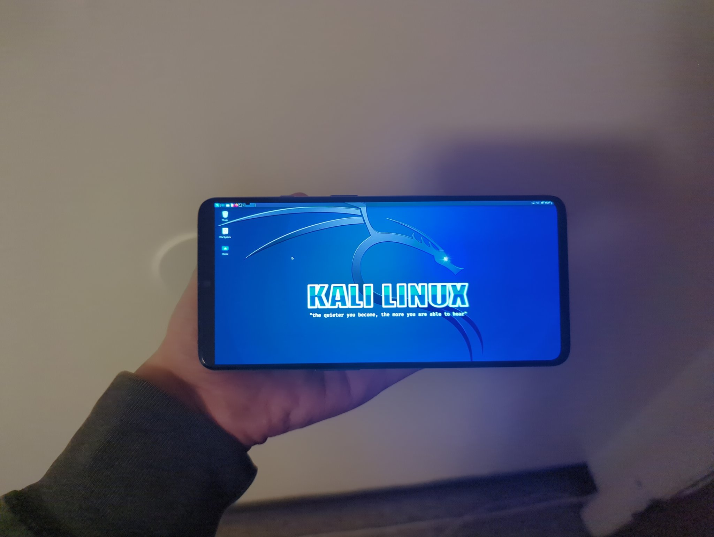
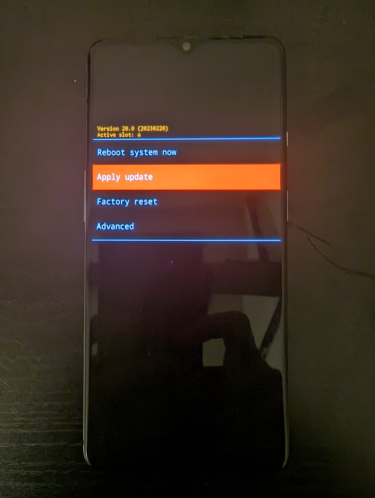

**Update**: DivestOS has been discontinued and downloads are no longer available.

**This will turn your device into a purely penetration testing device, and it will be very insecure for any other purpose. Please do not do this on your daily driver.**

_This procedure should work without modification on many devices using the standard Android bootloader (not Samsung). However, every device has unique quirks that may require special attention._



Originally, I just needed a device to run packet capture on my other devices. I have a OnePlus 7T laying around which I am not using for anything (since it has already reached its end-of-life), so I thought it would be cool to give it a new purpose. I am using DivestOS here since it is my go&#8209;to Android distribution, but you can use LineageOS or any other distribution if you want to.

Officially, Kali Nethunter only supports OxygenOS based on Android 10 or 11 on my device. However, since there is no security to be had anyways, I decided to have some fun and not do things by the book (their official documentation isn't accurate anyways, as I will explain).

## Installing DivestOS

The installation procedure for DivestOS is fairly straightforward. First [download the recovery](https://divestos.org/pages/devices) and boot it using fastboot:

```
fastboot reboot /path/to/the/divestos/recovery.img
fastboot reboot recovery
```



Select Apply Update and Apply Update from ADB:

```
adb sideload /path/to/the/divestos.zip
```

Do not attempt to relock the bootloader&nbsp;--- we need to leave it unlocked to enable privileged access ("rooting") anyways. Do not reboot into the OS at this stage either.

## Installing Magisk and disabling forceencrypt

The official documentation recommends [TWRP](https://twrp.me/) and [Disable_Dm&#8209;Verity_ForceEncrypt](https://forum.xda-developers.com/t/deprecated-universal-dm-verity-forceencrypt-disk-quota-disabler-11-2-2020.3817389/). However, TWRP doesn't exist for Android 12 and above for my device, and Disable_Dm&#8209;Verity_ForceEncrypt is deprecated and doesn't even work on Android 11.

Instead, we will use the [LineageOS recovery](https://download.lineageos.org/devices/) (which allows flashing files with arbitrary signatures) and [Disable Force Encryption NEO](https://forum.xda-developers.com/t/a-b-a-only-script-read-only-erofs-android-10-universal-disable-force-encryption-for-ro-and-rw-neo-stable.4454017/).

First, reboot the device into the bootloader.

Then, you need to download the LineageOS Recovery for your device and boot into it:

```
fastboot reboot /path/to/the/lineageos/recovery.img
```

Next, you just need to do ADB sideload for Disable Force Encryption NEO. It will give you the option to install Magisk and disable forceencrypt, and choose yes on both. The rest of the options are up to you - they are not very important.

## Installing Kali Nethunter Lite

Reboot into your OS and set it up normally. Make sure that encryption is disabled:


Finally, [download](https://www.kali.org/get-kali/#kali-mobile) the appropriate build for Nethunter and flash it as a Magisk module in the Magisk Manager.

Happy NetHunting!
