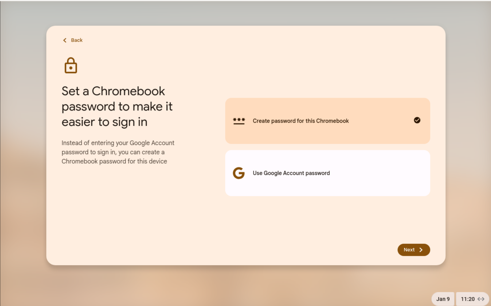
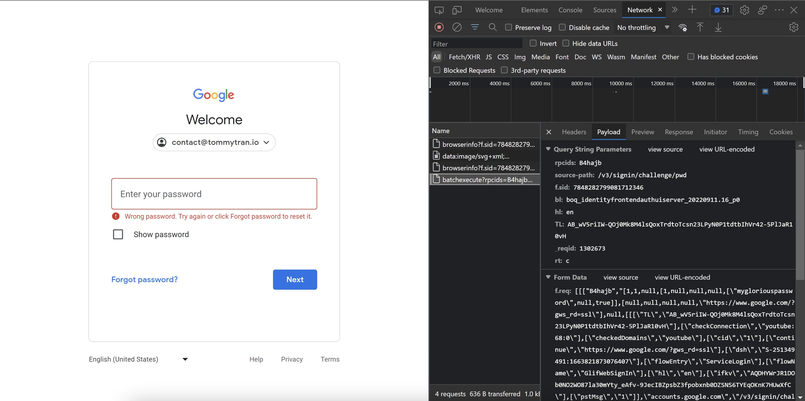
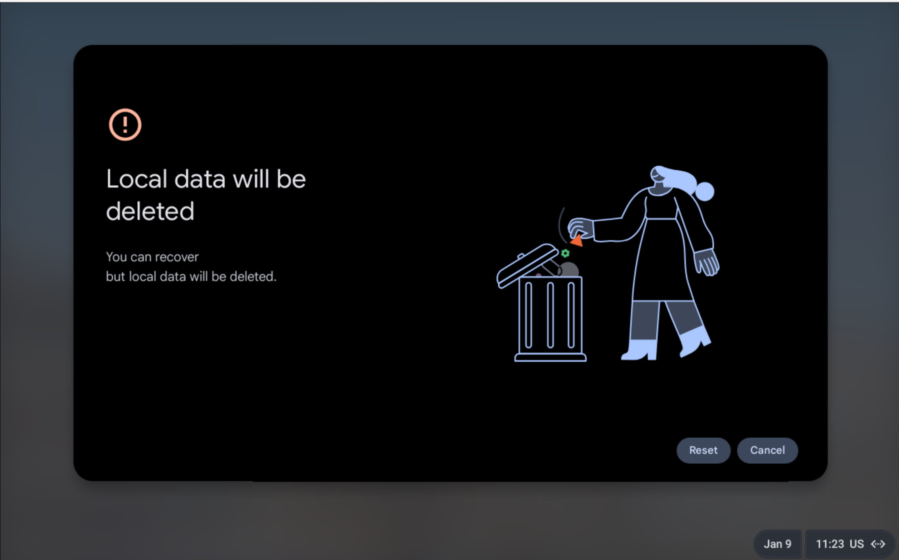

## Premise

ChromeOS encrypts user data on the disk by default. The implementation details are [documented upstream](https://www.chromium.org/developers/design-documents/tpm-usage/#TOC-Protecting-User-Data-Encryption-Keys "TPM Usage — The Chromium Projects") but not relevant within the scope of this post.

It is well-known that ChromeOS uses Google account passwords as the primary login credentials. This necessarily means that anyone with knowledge of the Google account password is able to unlock and therefore decrypt a ChromeOS user profile.

Recent versions of ChromeOS also allows users to use a separare login password instead of the Google account password.

## Practical Implications

The very same Google account passwords used for ChromeOS authentication are also used for logging in to various Google services in web browsers and other apps. After a quick investigation with browser dev tools:

&hellip;It turns out that passwords are submitted to Google servers in plaintext (see "mygloriouspassword" in the Form Data).

As a result, someone with sufficient access to Google's servers would theoretically be able to obtain the actual, unhashed password for a given Google account. An adversary with physical access would be able to unlock and decrypt ChromeOS user data with cooperation from Google, if the Google password is used for encryption.

This differs from how encryption passwords are handled by other services like cloud&#8209;based password managers&nbsp;&mdash; they use _client&#8209;side hashing_ to deliberately blind the server from the actual password. As the name suggests, the browser locally executes a cryptographic hash function on the actual password and only transmits the _resultant hash_ to the server for authentication.

The user should be able to avoid this issue with the local password. While we have not done in-depth analysis to confirm that Google never has access to the local encryption password, this is likely the case since an account recovery using the Google password will require a Powerwash:

## Takeaways

If Google is malicious, coerced by the government, or hacked, their servers can record the user password prior to it being hashed server&#8209;side. That password can then be used by an adversary with physical access to unlock ChromeOS and gain access to the data stored therein, if the Google account password is used for encryption.

As a result, when setting up your Chromebook, it is highly recommended that you use a local password instead.
