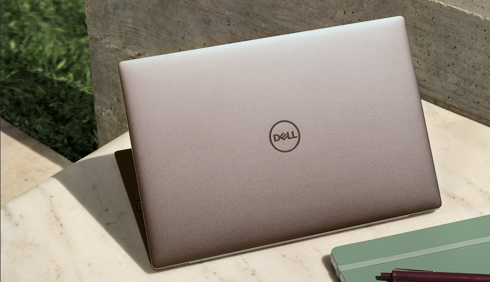
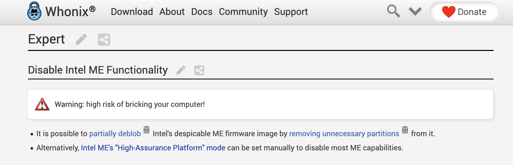
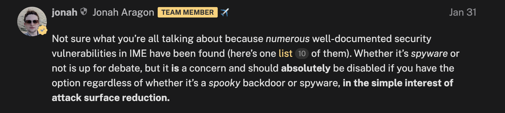
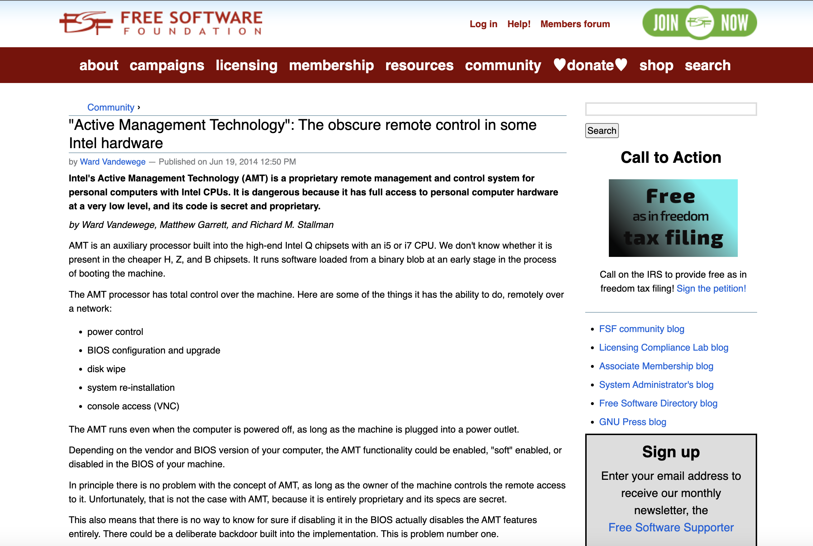
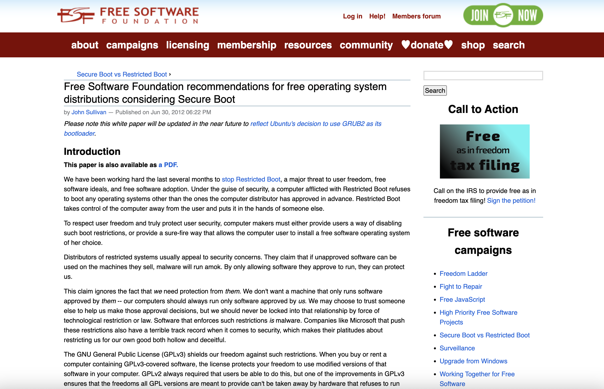
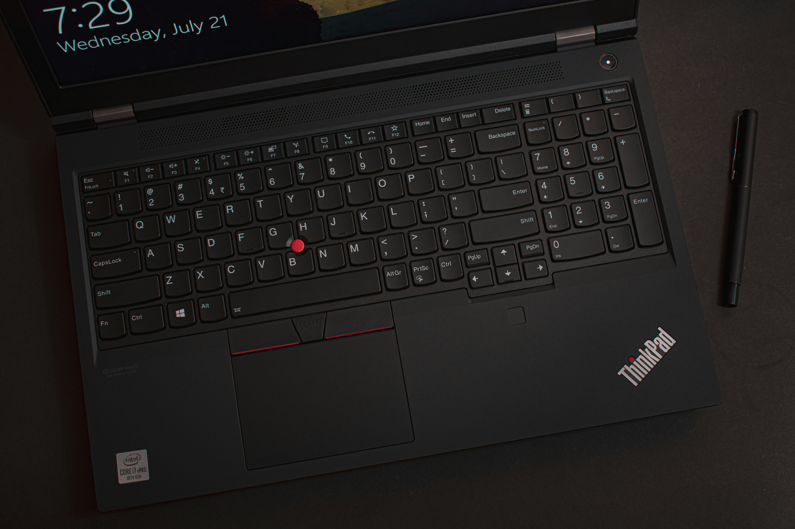

While browsing privacy forums, I often see a lot discussions regarding laptop hardware security, especially in regards to resistance against physical attacks. Unfortunately, most of the advice given on these forums are incorrect, recommending people to buy overpriced products that are significantly less secure than standard laptops.

In this post, I will walk you through a quick overview of how hardware security is generally implemented for laptops, what to look for, and what to avoid. We will not discuss MacBooks or Chromebooks, as they are vastly different from normal x86 Windows/Linux hardware.

## The Benchmark

To start off, the best laptops I have found are modern the Dell Latitude/Precision laptops with an Intel vPro Enterprise CPU. The second best group of laptops I have found are modern Lenovo Thinkpads with Intel vPro Enterprise or AMD Ryzen Pro CPUs. These are relatively easy to acquire and share these common security properties:

- Have Intel Boot Guard or AMD Platform Secure Boot to protect the firmware
- Have regular firmware updates ([monthly updates for Dell](https://www.dell.com/support/kbdoc/en-us/000197092/dell-drivers-and-downloads-update-release-schedule), and [bi-monthly updates for Thinkpads](https://support.lenovo.com/us/en/solutions/ht515365-thinkpad-driver-and-firmware-update-release-schedule))
- Support firmware updates via the [Linux Vendor Firmware Service](https://www.fwupd.org/)
- Support custom Secure Boot key enrollment
- Support disabling Microsoft third-party certificate authoritity
- Support memory encryption
- Support [kernel DMA protection](https://learn.microsoft.com/en-us/windows/security/hardware-security/kernel-dma-protection-for-thunderbolt)
- Support SMM Mitigation
- Support DRTM technologies
- Meet [Secure-cored requirements](https://learn.microsoft.com/en-us/windows-hardware/design/device-experiences/oem-highly-secure-11) for Windows
- Meet [HSI-4](https://fwupd.github.io/libfwupdplugin/hsi.html#hsi-level4) for Linux
- Still recieve Microcode updates from Intel and AMD

As such, I will be comparing everything else in this post against these laptops, 

## Boot Security

For boot security, there are 2 different technologies: Static Root of Trust Measurement (SRTM) and Dynamic Root of Trust Measurement (DRTM). I will primarily discuss SRTM here, but I will quickly go over DRTM as well.

### SRTM

In general, SRTM works as follows:
- The public key for the firmware by the OEM is fused into an immutable Root of Trust. With Intel Boot Guard, this will be in the chipset (PCH). With AMD Platform Secure Boot, this will be in the CPU.
- The CPU ensures that a significant portion of firmware from the EEPROM (BIOS chip) is signed by the OEM. This includes the Boot Block.
- The Boot Block performs measurements of the firmware and its settings and submit those measurements to PCR 0.
- The next stages measures things like the firmware configuration, boot loader, partition table, Secure Boot state, and so on. These are submitted to PCR 2,3,5,7, and so on.
- UEFI Secure Boot validates the signature of the bootloader against the Secure Boot database.
- The boot loader submits additional measurements to other PCRs. In the case of GRUB, it will use PCR 8 or 9 for instance.

After the user has set up disk encryption, they can seal a encryption key protector to the TPM against certain PCRs, and optionally protect it with a PIN.

Should an attacker attempt to flash malicious firmware onto the EEPROM, the laptop will refuse to boot, and will throw a Boot Guard / Platform Secure Boot violation. Should they try to downgrade the firmware version, change firmware settings or disable UEFI Secure Boot, PCR 0, 1, and 7 will change respectively. The TPM will not recieve the correct measurements and will not release the encryption key protector.

This is not perfect, and the user still needs to set up additional protection for the boot stages after the boot loader, but it is an okay start and is significantly better than how some vendors try to do it as we will discuss down below.

### DRTM

In general, DRTM works by loading in an ACM binary signed by the CPU vendor along what the system is trying to boot. The ACM binary will perform measurements of the environment and submit the results to certain PCRs. In the case of Intel TXT, PCR 17 and 18 are used. The measurements then can be used to for remote attestation or to release a secret stored in the TPM if it matches the TPM policy.

On Windows, DRTM is implemented with [System Guard](https://learn.microsoft.com/en-us/windows/security/hardware-security/how-hardware-based-root-of-trust-helps-protect-windows) for attestation and reducing trust in the UEFI firmware. On Linux, DRTM is not widely used yet, but [TrenchBoot](https://trenchboot.org/) is being developed to address that.

It is important to note that DRTM technologies can be bypassed via the System Management Mode (SMM), so you still need to have some level of trust in your firmware to implement SMM mitigations. In essence, you still need to rely on SRTM to some extent.

## Common Misinformation

### Intel CSME and AMD PSP

A very common misinformation among privacy communities is that the Intel Management Engine (ME), its sucessor - Intel Converged Security and Management Engine (CSME), and AMD Platform Security Processor (PSP) are some sort of evil backdoor. Some may go so far as to tell the user to "disable the ME", either out of [paranoia](https://www.whonix.org/wiki/System_Hardening_Checklist#Disable_Intel_ME_Functionality) or for ["attack surface reduction"](https://discuss.privacyguides.net/t/linux-laptops-system76-other-options/16557/19):

The problem with these recommendations are as follows:

Intel CSME provides critical security features, including but not limited to:
- Boot Guard (The basis of SRTM, as discussed above)
- Firmware TPM (Generally better than dedicated TPMs by being not being vulnerable to bus sniffing)
- Memory Encryption (on Intel vPro Enterprise systems)
- Intel Locker (A nice vPro Enterprise mechanism to purge the encryption key from memory after early boot - not widely used on Linux yet, but is implemented on ChromeOS)

AMD PSP provides similar security features:
- Firmware TPM
- Memory Encryption (on Ryzen Pro and EPYC systems)

By disabling Intel CSME, you are **increasing the attack surface** by crippling security features. Additionally, if you buy hardware so old that you can run `me_cleaner` to disable the ME yourself, it means that these hardware do not have Boot Guard and it is impossible to implement any kind of boot security.

This excercise also achieves nothing to protect against a hypothetical scenario where Intel and AMD are malicious. Intel and AMD do not need the co-processor to implement a backdoor - they can simply introduce CPU vulnerabilities like Spectre and Meltdown if they want to. If you do not trust a CPU vendor, the only mitigation is to not use said vendor.

### Intel AMT and AMD DASH

Another misinformation regarding CSME is that it is provides some kind of [shady "remote management" system](https://www.fsf.org/blogs/community/active-management-technology) for your computer. In reality, this is the AMT component which only exists on Intel vPro CPUs. It is meant for IT teams to manage systems with technologies like Serial over LAN, Solarwind, etc.

Here are some facts about it:
- You can disable it firmware settings.
- Certain firmware allows you to permanently disable it by blowing an eFuse.
- It is detectable. An easy way is to just go visit port 16992/tcp on your device.
- To be extra sure, you can also run `nmap` to scan the port from a different device.

This is not something hidden, people have accidentally [run into AMT](https://mastodon.lilysthings.org/@i_lost_my_bagel/112228352384742242) on social media.

For attack surface reduction, you should absolutely disable it. If you do not have a vPro laptop and are wondering what it looks like, have a look at the [BIOS Simulator for the Thinkpad T14 Gen 5](https://download.lenovo.com/bsco/#/graphicalsimulator/ThinkPad%20T14%20Gen%205%20(21ML,21MM)).

With that said, don't let the scary claims about "remote management" by the Free Software Foundation spook you - if some sort of hypothetical backdoor is actually implemented this way, it will not be hard to detect it. There are better ways to implement a backdoor as discussed above, and if you don't trust the CPU vendor you should avoid them as a whole, not just the vPro model.

Some people recommend buying AMD instead of Intel to avoid the possibility of having Intel AMT. However, they also miss a very simple fact that AMD has an equivalent technology for their Ryzen Pro CPU - [AMD DASH](https://www.amd.com/system/files/documents/out-of-band-client-management-overview.pdf).

### Restricted Boot

Another false claim regarding Secure Boot by the Free Software Foundation is that UEFI Secure Boot is somehow Microsoft's evil attempt to lock users out of their computer by [only allowing it to run Microsoft approved software](https://www.fsf.org/campaigns/secure-boot-vs-restricted-boot/whitepaper-web):

In reality, most if not all laptops with UEFI Secure Boot allows you to disable it - you can run whichever operating system you want. While it is true that certain lines of laptops like Razer do not allow custom key enrollment, proper business laptops like Dell Latitude/Precision and Lenovo Thinkpad do. You can enroll your own Secure Boot key and tell your laptop to boot only the system you trust.

Another benefit of laptops with Microsoft's Secure-cored certification is that you can have the **Freedom** to disable the Microsoft Secure Boot Third-Party Certificate Authority and still have the laptop function normally. This is especially handy if you plan to run Windows as your operating system.

UEFI Secure Boot is not Restricted Boot. It is a building block of SRTM and how you can build a secure boot environment.

## Insecure Products

Now that we have covered SRTM and common misconceptions, let's discuss some insecure products.

### Heads, PureBoot, and Purism

#### Heads

Heads is built around the desire for the signing key for the firmware to be in the posession of the user instead of the OEM. They also want the user to be able to change the key in case they lose access to it. In general, this is how Heads works:

- The user enrolls their GPG public key into the firmware.
- The user signs the files /boot with their GPG key.
- The firmware performs measurements of itself and seal HOTP and TOTP secrets into the TPM against certain PCRs.
- When the system boots, the firmware measures itself, starting with the boot block doing measurements.
- If the measurements match what the TPM expects, the HOTP or TOTP secret will be released.
- The HOTP secret can be checked against a NitroKey, or the TOTP secret can be checked against an authenticator app on the user's phone.
- The firmware checks if the files in /boot are signed by the GPG key.
- If everything is as expected, the system will boot normally.

The problem with this design is that everything hinges on the boot block doing its initial measurements truthfully. Since the user is supposed be able to change the key, no key can be set up with Boot Guard to protect the boot block. The result is that there is nothing stopping an attacker from flashing a piece of malicious firmware that will just lie about the measurements. At best, Heads can protect against tampering of the disk, but it cannot protect against tampering of the firmware.

#### PureBoot & Purism

Purism sells their laptops with PureBoot, a fork of Heads. It works in pretty much the same way, with a few extra features.

Let's go through some of their claims and contrast that agains reality.

> PureBoot can protect against firmware tampering.

It cannot protect against firmware tampering as discussed in the [Heads](#heads) section.

> [The ME is disabled (HAP set to 1), and mostly wiped with `me_cleaner`](https://puri.sm/learn/intel-me/).

They only set the HAP field now, but you have to find that out through a [forum post](https://forums.puri.sm/t/librem-14s-me-disabled-but-not-neutralized/12238). Regardless, they crippled critical security features including the ones described in the [Intel CSME and AMD PSP](#intel-csme-and-amd-psp) section.

> PureBoot is [not vulnerable](https://puri.sm/posts/pureboot-not-vulnerable-to-uefi-exploits-again/) to UEFI firmware vulnerabilities which lead to Boot Guard bypasses.

They referenced the LogoFail vulnerability where the firmware's image parser can be exploited to make the firmware run arbitary code despite of being verified by Boot Guard. In Purism's case, they do not even use Boot Guard to begin with, so there is no basic protection to even bypass. They are just vulnerable by design.

> There is a special ["blob jail"](https://puri.sm/posts/intel-ax200-wi-fi-bluetooth-shipping-for-new-orders/) for the Wifi card.

The "blob jail" is not special. It is an imitation of how the `linux-firmware` package works, and it only exists because they are refusing to ship firmware updates through PureOS. The blobs inside of the "blob jail" are not any more isolated than the blobs provided by `linux-firmware`. It is much more proper to just ship firmware for peripherals through the OS like normal distributions than shipping it through a boot firmware that requires manual updates.

The harshest reality of all, is that because of how much they have crippled hardware security, [Librem laptops are at HSI level 0](https://www.fwupd.org/lvfs/hsireports/device?host_vendor=Purism&host_family=Librem+14&host_product=Librem+14). You should avoid all Heads laptops and Purism products.

### Laptops without Firmware Protection

Unfortunately, much like Purism, a lot of "Linux-focused" laptop vendors either do not set up Boot Guard, or set it up incorrectly. These include, but not limited to:

- [StarLabs](https://www.fwupd.org/lvfs/hsireports/device?host_vendor=Star+Labs&host_family=I3&host_product=Lite).
- [System76](https://www.fwupd.org/lvfs/hsireports/device?host_vendor=System76&host_family=&host_product=Darter+Pro)
- [Tuxedo](https://www.fwupd.org/lvfs/hsireports/device?host_vendor=TUXEDO&host_family=&host_product=TUXEDO+InfinityBook+Pro+14+Gen6)

You should avoid buying from these vendors as well, as it is impossible to have any kind of firmware security without Boot Guard. They all have HSI level 0.

### Laptops with Insufficient Firmware Updates

### Ancient laptops

### RYF and the Illusion of Freedom

Ariadne Conill has a great [blog post](https://ariadne.space/2022/01/22/the-fsfs-relationship-with-firmware-is-harmful-to-free-software-users/) on how the Free Software Foundation handle firmware updates and blobs.

In short, they consider a piece of hardware "blob free" if it containers proprietary firmware that cannot be updated, but anything with updatable firmware is not "blob free".

As a result, any pie

## Better Products

### Dell Latitude/Precision

Dell business laptops have the best firmware security among all laptops I have personally evaluated. However, they are not without faults that you should be aware of:

- There is a default BIOS recovery password tied to the device serial number. You can disable this by enabling the [Master Password Lockout](https://www.dell.com/support/kbdoc/en-us/000180749/dell-client-products-unauthorized-bios-password-reset-tools) setting.
- Dell sometimes forget to update the firmware for certain products like the Latitude 9440 and Latitude 9450 to LVFS. Be sure to check your device [update history](https://www.fwupd.org/lvfs/devices/) before purchasing any device, especially from Dell.
- The microphone toggle in the firmware does not actually turn off the mic. I have verified that this is the case by booting into a fresh Linux installation and recorded myself despite of the mic being set to off.
- Some settings like Hyper Threading do not have their values measured by the firmware.

### Lenovo ThinkPad

In my opinion, vPro Enterprise Thinkpad laptops security are generally acceptable for the product class. However, there is a big gotcha with their firmware: **the "prevent BIOS downgrade" toggle does not actually work**. This toggle only nicely asks Windows to not downgrade the firmware, but if a tool like fwupd tries to downgrade it, the firmware will allow the downgrade.

The implication of this is that if you have the UEFI update capsule enabled, a compromised OS can downgrade your firmware to a version vulnerable with something like LogoFail, and the malware can then gain persistent in the firmware. The problem can theoratically be solved if Lenovo blows Boot Guard fuses to prevent downgrade, but in reality they do it even less often than Dell.

For this reason, I recommend buying Dell Latitude/Precision over Lenovo products. If you have to use a Lenovo laptop anyways, consider disabling the UEFI capsule, and use a different, trusted computer to create a USB stick for firmware updates.