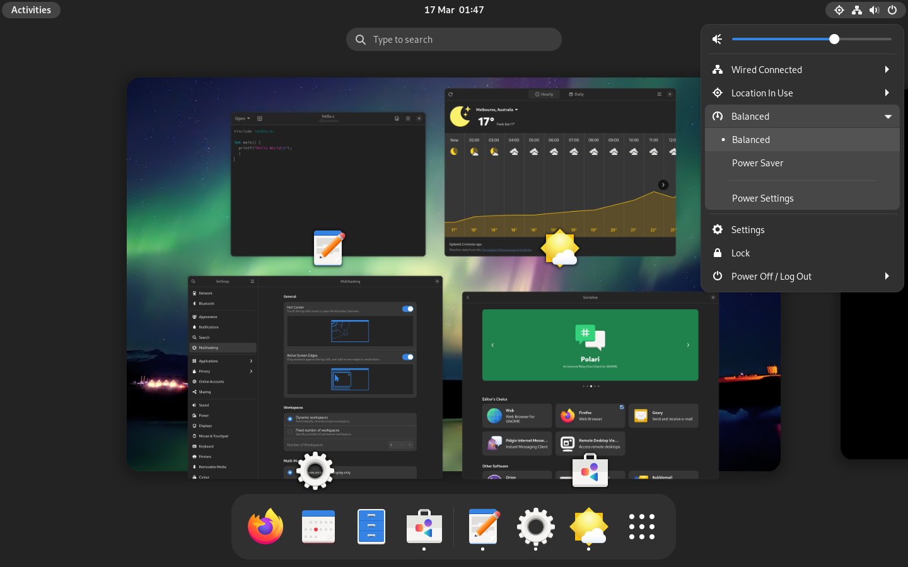

Not all Linux distributions are created equal. When choosing a Linux distribution, there are several things you need to keep in mind.

## Release Cycle

You should choose a distribution which stays close to the stable upstream software releases, typically rolling release distributions. This is because frozen release cycle distributions often don’t update package versions and fall behind on security updates.

For frozen distributions, package maintainers are expected to backport patches to fix vulnerabilities (Debian is one such [example](https://www.debian.org/security/faq#handling)) rather than bump the software to the “next version” released by the upstream developer. Some security fixes [do not](https://arxiv.org/abs/2105.14565) receive a [CVE](https://en.wikipedia.org/wiki/Common_Vulnerabilities_and_Exposures) (particularly less popular software) at all and therefore do not make it into the distribution with this patching model. As a result minor security fixes are sometimes held back until the next major release.

In fact, in certain cases, there have been vulnerabilities introduced by Debian because of their patching process. [Bug 1633467](https://bugzilla.mozilla.org/show_bug.cgi?id=1633467) and [DSA-1571](https://www.debian.org/security/2008/dsa-1571) are examples of this.

The practice of holding packages back and applying interim patches is generally not a good idea, as it diverges from the way the developer might have intended the software to work. [Richard Brown](https://rootco.de/aboutme/) has a presentation about this:



Even if you are worried about the stability of the system because of regularly updated packages (which you shouldn't be), it makes more sense to use a system which you can safely update and rollback instead of an outdated distribution partially made up of unreliable backport packages without an easy rollback mechanism in case something goes wrong like Debian.

## Arch-based Distributions

Arch Linux has very up-to-date packages with minimal downstream patching. That being said, Arch-based distributions are not recommended for those new to Linux, regardless of the distribution. Arch does not have an distribution update mechanism for the underlying software choices. As a result, you have to stay aware with current trends and adopt technologies as they supersede older practices on your own.

For a secure system, you are also expected to have sufficient Linux knowledge to properly set up security for your system such as adopting a [mandatory access control](https://en.wikipedia.org/wiki/Mandatory_access_control) system, setting up [kernel module](https://en.wikipedia.org/wiki/Loadable_kernel_module#Security) blacklists, hardening boot parameters, manipulating [sysctl](https://en.wikipedia.org/wiki/Sysctl) parameters, and knowing what components you need such as [Polkit](https://en.wikipedia.org/wiki/Polkit).

If you are experienced with Linux and wish to use an Arch-based distribution, you should use Arch Linux proper, not any of its derivatives. Downstream distributions may come with bad practices like holding back packages (as is the case with Manjaro), blindly building packages from the AUR (as is the case with Garuda and its [Chaotic-AUR](https://aur.chaotic.cx/) repository), or just not setting up the basics such as mandatory access control or firewalls.

## “Security-focused” Distributions

There is often some confusion about “security-focused” distributions and “pentesting” distributions. A quick search for “the most secure Linux distribution” will often give results like Kali Linux, Black Arch and Parrot OS. These distributions are offensive penetration testing distributions that bundle tools for testing other systems. They don’t include any “extra security” or defensive mitigations intended for regular use.

## Linux-libre Kernel and “Libre” Distributions

**Do not** use the Linux-libre kernel, since it [removes security mitigations](https://www.phoronix.com/scan.php?page=news_item&px=GNU-Linux-Libre-5.7-Released) and [suppresses kernel warnings](https://news.ycombinator.com/item?id=29674846) about vulnerable microcode for ideological reasons.

If you want to use one of these distributions for reasons other than ideology, you should make sure that they there is a way to easily obtain, install, and update a proper kernel and missing firmware. For example, if you are looking to use [GUIX](https://guix.gnu.org/en/download/), you should absolutely use something like the [Nonguix](https://gitlab.com/nonguix/nonguix) repository and get all of the fixes as mentioned above.

## Desktop Environments

Consider using GNOME as your desktop environment. It supports [Wayland](https://en.wikipedia.org/wiki/Wayland_(display_server_protocol)), a display protocol developed with security [in mind](https://lwn.net/Articles/589147), and implements permission control for privileged Wayland protocols like `screencopy`. There are other desktop environments and window managers with Wayland support, but we are not aware of any permission control implemented by them. One caveat with GNOME is that it is written in unsafe languages, but we think the trade off for permission control is well worth it.

Wayland's predecessor, [X11](https://en.wikipedia.org/wiki/X_Window_System), does not support GUI isolation, allowing all windows to [record screen, log and inject inputs in other windows](https://blog.invisiblethings.org/2011/04/23/linux-security-circus-on-gui-isolation.html), making any attempt at sandboxing futile. While there are options to run nested X11 sessions such as [Xpra](https://en.wikipedia.org/wiki/Xpra) or [Xephyr](https://en.wikipedia.org/wiki/Xephyr), they often come with negative performance consequences, are not convenient to set up, and are not preferable to Wayland. You should avoid desktop environments and window managers which only support X11.

## Recommended Distributions

Here is a quick, non-authoritative list of distributions we recommend over others:

### SecureBlue

[SecureBlue](https://secureblue.dev/) is the best traditional desktop Linux operating system for privacy and security. It provides hardened operating system images based on Fedora Atomic Desktops. While they do additional parties of trust (SecureBlue, GitHub infrastructure, BlueBuild, Negativo, etc), their images are substantially hardened and not easily replicated by hand. There are several very interesting packages maintained by SecureBlue as well:
- [Trivalent](https://github.com/secureblue/Trivalent), a hardened chromium desktop build with patches from GrapheneOS's [Vanadium](https://github.com/GrapheneOS/Vanadium).
- [Hardened Malloc](https://github.com/secureblue/fedora-extras/tree/live/hardened_malloc). SecureBlue packages GrapheneOS's memory allocator and enables it system wide, including for Flatpak applications.

### Fedora Workstation

[Fedora Workstation](https://getfedora.org/en/workstation/) is a great general-purpose Linux distribution, especially for those who are new to Linux. It is a semi-rolling release distribution. While some packages like GNOME are frozen until the next Fedora release, most packages (including the kernel) are updated frequently throughout the lifespan of the release. Each Fedora release is supported for one year, with a new version released every 6 months. The distribution takes an "upstream first" approach and ship packages with minimal downstream patching, and the patches are done in a sensible manner which does not unexpectedly break functionalities [unlike Debian](https://github.com/keepassxreboot/keepassxc/issues/10725).

With that, Fedora generally adopts newer technologies before other distributions e.g., [Wayland](https://wayland.freedesktop.org/) and [PipeWire](https://pipewire.org/). These new technologies often come with improvements in security, privacy, and usability in general.

Fedora's package manager, `dnf`, has a great rollback and undo feature that is generally missing from other package managers. You can read more about it on [Red Hat's documentation](https://access.redhat.com/documentation/en-us/red_hat_enterprise_linux/9/html/managing_software_with_the_dnf_tool/assembly_handling-package-management-history_managing-software-with-the-dnf-tool).

### Fedora Atomic Desktops

[Fedora Atomic Desktops](https://fedoraproject.org/atomic-desktops/) are immutable variants of Fedora with a strong focus on container workflows. While they do not provide security benefits over Fedora, they have a much more reliable update mechanism. Unlike traditional Linux where packages are updated one by one, Atomic Desktops will download a whole new OS image first before rebooting to switch over to the new image. The system cannot fail in the middle of an update, and should something be wrong with the new image, it only takes one reboot to return the system to its previous state. Should you feel the `dnf` rollback mechanism isn't enough, we recommend giving Fedora Atomic Desktops a try.

[Adam Šamalík](https://twitter.com/adsamalik) has a presentation with `rpm-ostree` in action:



One caveat with Fedora Atomic Desktops is that `rpm-ostree` currently has a hard dependency on `grub` and does not support Unified Kernel Images. The consequence of this is that unlike Fedora Workstation, it is not possible to set up a Fedora Atomic system with meaningful Secure Boot to resist physical tampering.

### openSUSE Aeon

Fedora Atomic Desktop's European counterpart. openSUSE Aeon is a rolling release, fast updating distributions with [transactional updates](https://kubic.opensuse.org/blog/2018-04-04-transactionalupdates/) using [Btrfs](https://en.wikipedia.org/wiki/Btrfs) and [Snapper](https://en.opensuse.org/openSUSE:Snapper_Tutorial).

[Aeon](https://microos.opensuse.org/) has a relatively small set of base packages (thus lowering the attack surface) and mounts the running BTRFS subvolume as read-only. Updates are applied package by package to a new BTRFS snapshot before the system is rebooted to the new subvolume. This allows the rollback process to be relatively easy just like on Fedora Atomic Desktops.


