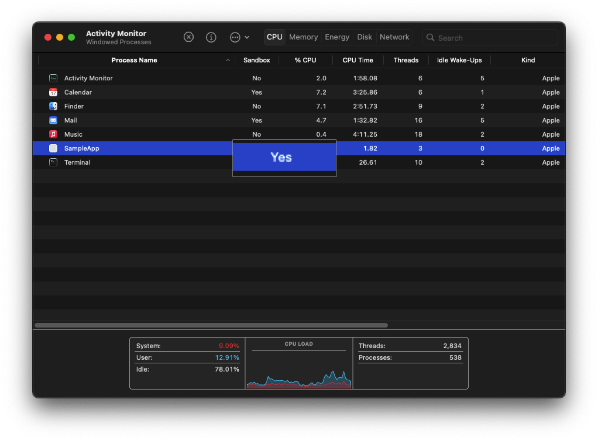

macOS comes equipped with many security features to keep you safe. Check out the [Apple Platform Security](https://support.apple.com/guide/security/welcome/web) page for more detail about the security features in a Mac.

## FileVault

By default, your macOS install is encrypted, but it will automatically unlock on boot. Turning on [FileVault](https://support.apple.com/guide/mac-help/protect-data-on-your-mac-with-filevault-mh11785/mac) will require a user password to unlock the volume. It also makes it so that you need to enter a user password to enter recovery mode.

## App Sandbox

The [App Sandbox](https://developer.apple.com/documentation/security/app_sandbox/protecting_user_data_with_app_sandbox) is a feature that limits the access an app has to the rest of your system. Developers enable it when they sign their app, so it's not possible for you to enable it or modify the entitlements since they are defined in the signature. 

The App Sandbox is designed to limit the damage to your system in the event an app is exploited, however it can't protect against malicious developers since they can just disable or weaken the sandbox in a future update if they want. For protection against malicious developers, you'll need to install apps from the App Store where the sandbox is enforced.

There are a few ways to check whether an app is sandboxed:

You can check whether running processes are sandboxed in the Activity Monitor. Right click on the columns and check "Sandbox"



You can check whether an app is sandboxed and what entitlements it has by running the command

``` zsh
% codesign -dvvv --entitlements - <path to your app>
```

If the app is sandboxed, you will see

``` zsh
    [Key] com.apple.security.app-sandbox
    [Value]
        [Bool] true
```

## Hardened Runtime

The [Hardened Runtime](https://developer.apple.com/documentation/security/hardened_runtime) is an optional security feature that developers can enable that makes an app more resistant to exploitation. It prevents certain classes of exploits, like code injection, dynamically linked library (DLL) hijacking, and process memory space tampering.

Unlike the App Sandbox, the Hardened Runtime is required in order for an app to be notarized and so you'll be warned by Gatekeeper if an app doesn't use it. While this warning is bypassable, you should be cautious and investigate a bit more before running it.

Check if an app is using the Hardened Runtime before running it with the command

``` zsh
codesign --display --verbose /path/to/bundle.app
```

You will see `flags=0x10000(runtime)` if it's enabled.

## Gatekeeper

[Gatekeeper](https://support.apple.com/guide/security/gatekeeper-and-runtime-protection-sec5599b66df/web) stops you from running apps that aren't notarized. Notarization is a process by which app developers submit their app to Apple to scan for malware and ensure it meets certain requirements. Among these are that it is signed with a key provided by Apple to the developer and that the Hardened Runtime is enabled. Gatekeeper also prevents the loading of unwanted plugins with benign apps by opening apps from randomized, read-only locations.

While the Gatekeeper warning can be easily bypassed by control + clicking on the app and clicking open, it's useful since it presents an unavoidable warning when you try to run an app for the first time that's not downloaded from the App Store.

## XProtect

XProtect is the built-in antivirus software in macOS. Like all AV, it's a last line of defense after all others have been bypassed.

XProtect uses YARA signatures and is updated frequently, independent of OS updates. This is one of the many reasons you should be cautious about blocking connections to Apple servers; many of them serve a security purpose, so make sure you know what you're blocking. It can also detect unknown malware using heuristics. When it detects unkown malware, it will send information about that software to Apple so that they can update the signatures in XProtect.

Apple also issues revocations for notarization tickets, which these are detected with online OCSP checks. Blocking these checks will make you more vulnerable to malicious apps.

## System Integrity Protection

[SIP](https://support.apple.com/guide/security/system-integrity-protection-secb7ea06b49/web) protects [system files](https://support.apple.com/en-us/102149) from being changed, even by the root user. Since it's protecting your base system files, you should **never** disable it even temporarily if you want the best security.

On Apple Silicon Macs, it's combined with [Kernel Integrity Protection](https://support.apple.com/guide/security/operating-system-integrity-sec8b776536b/web#sec41bf3cd61) to protect kernel memory from being exploited.

## Secure Boot

Mac computers ensure that only Apple-signed code runs from the lowest levels of the firmware to macOS itself. It accomplishes this with a [chain of trust](https://support.apple.com/guide/security/boot-process-secac71d5623/web) that starts with the Boot ROM burned into the Secure Enclave at the factory as the first step.

A unique feature of Mac computers is that you can set a different LocalPolicy for different installs, so you could have your main macOS with Full Security set and also an Asahi Linux install set to Permissive Security and it won't affect the security of your macOS.

## DMA Protection

Mac computers have an [IOMMU](https://support.apple.com/guide/security/direct-memory-access-protections-seca4960c2b5/1/web/1) so that each DMA agent, including PCIe and Thunderbolt ports, can only access memory explicitly mapped for their use.

## Lockdown Mode

[Lockdown Mode](https://support.apple.com/en-us/105120) is an optional security feature that disables lots of attack surface in your Mac. It may break certain things like websites or apps, but you can disable it for individual apps or websites if you need to.

## Custom umask

macOS is a Unix-like, so certain security practices carry over from other systems. Consider setting a [stricter umask](https://support.apple.com/en-us/101914).

## Terminal Secure Keyboard Entry

To prevent other apps from detecting what you type in Terminal, enable [Secure Keyboard Entry](https://support.apple.com/guide/terminal/use-secure-keyboard-entry-trml109/mac).

## Standard User Account

When you first set up your Mac, you will create an Administrator account that has powerful access to the OS. [Apple recommends](https://support.apple.com/guide/mac-help/set-up-your-mac-to-be-secure-flvlt003/mac) limiting the number of Administrator accounts on your machine and using a Standard user account when Aministrator privileges aren't needed.

You can [hide an administrator account](https://support.apple.com/en-us/102099) so you don't accidentally log into it.

Also make sure to set a strong password for any accounts you make and set a time after which a user will [automatically be logged out](https://support.apple.com/guide/mac-help/set-your-mac-to-log-out-when-not-in-use-mchlp2443/14.0/mac/14.0).

## Lock Screen Security

Make sure you [require users to login](https://support.apple.com/guide/mac-help/set-up-your-mac-to-be-secure-flvlt003/mac#mchlpf5777a4) and set your Mac to [require a password](https://support.apple.com/guide/mac-help/require-a-password-after-waking-your-mac-mchlp2270/14.0/mac/14.0) after waking up.

Use the Control + Command + Q keyboard shortcut to lock your screen any time you leave your computer.

## Prevent Windows from Reopening

When you restart your Mac, you'll get a dialog box that asks if you want to reopen windows when you restart. It's best to [turn this off](https://support.apple.com/en-ca/102318) to prevent data from previous sessions from being retained.

## Automatically Empty Trash

You can set the trash to [automatically empty](https://support.apple.com/en-ca/guide/mac-help/mchlp1093/14.0/mac/14.0#mchl0deca7f1) every 30 days to prevent old unwanted files from sticking around.

## Show File Extensions

You should set Finder to always [show all file extensions](https://support.apple.com/en-ca/guide/mac-help/mchlp2304/mac) to help you see when a file is masquerading as another filetype.

## System Extensions

There are two types of [system extensions](https://support.apple.com/en-us/120363) on macOS: legacy system extensions (also known as kernel extensions) and system extensions. Kernel extensions modify the actual kernel, giving the software extremely low-level access to your system. These are very dangerous and in fact you need to lower your security policy to even load them. They're being phased out more and more with every version of macOS.

Newer system extensions don't directly modify the kernel, but they use APIs that give them lower level access to your system than regular apps. You should be very cautious with these as well and only allow them when **absolutely necessary**.

## Apps Requiring Admin

Be careful installing apps that require Administrator privileges to run, you're giving them a lot of power in your system.

**Note**: When mounting a .dmg file, usually a graphic will come up asking you to move the app to your Applications folder, which will trigger an Administrator popup. The app isn't actually running, you're just moving it to the systemwide Applications folder so that all users on the system can run it. If you're not comfortable with this, you can simply drag the app anywhere else and run it.

## Firewall

macOS comes with a built-in [firewall](https://support.apple.com/guide/mac-help/change-firewall-settings-on-mac-mh11783/mac). Make sure it's enabled at the very least, but you can block all incoming connections for the best security/privacy.