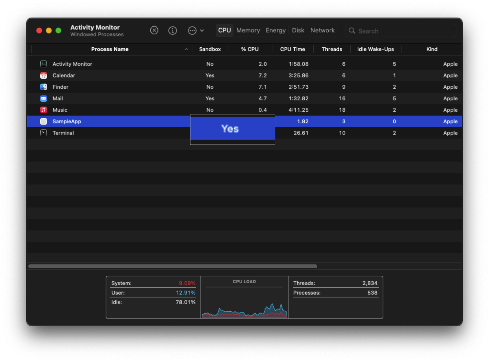

macOS comes equipped with many security features to keep you safe. Check out the [Apple Platform Security](https://support.apple.com/guide/security/welcome/web) page for more detail about the security features in a Mac. This guide assumes you're running on official Apple hardware that's officially supported by the latest stable version of macOS.

## FileVault

By default, your macOS install is encrypted, but it will automatically unlock on boot. Turning on [FileVault](https://support.apple.com/guide/mac-help/protect-data-on-your-mac-with-filevault-mh11785/mac) will require a user password to unlock the volume. It also makes it so that you need to enter a user password to enter recovery mode.

FileVault works with two encryption keys: the volume key and the class key. The volume key encrypts the data in your drive and with FileVualt turned on, the class key encrypts the volume key. The class key is protected by a combination of the user’s password and the hardware UID when FileVault is turned on, meaning that the user password is required and the key is tied to the device and can't be decrypted outside the actual hardware.

All encryption keys are handled by the Secure Enclave and are never exposed to the CPU.

Your Mac is at its most secure when it's fully off and the data is at rest. Depending on your threat model, it might behoove you to turn your Mac off completely whenever you're not using it, especially since Macs don't have memory encryption.

macOS keeps the encryption key in memory when sleeping so that you can quickly resume what you were doing. You can set the Mac to hiberate after a certain amount of time and destroy the FileVault key, leaving your data in a much more secure state. To set your Mac to hibernate destroy the key on hibernating:

```zsh
sudo pmset -a destroyfvkeyonstandby 1
sudo pmset -a hibernatemode 25
```

## App Sandbox

The [App Sandbox](https://developer.apple.com/documentation/security/app_sandbox/protecting_user_data_with_app_sandbox) is a feature that limits the access an app has to the rest of your system. Developers enable it when they sign their app, so it's not possible for you to enable it or modify the entitlements since they are defined in the signature.

Sandboxed apps are given their own container in `~/Library/Containers` that they have exclusive read/write access to. Unsandboxed apps can't access it unless they have root privileges.

The App Sandbox is designed to limit the damage to your system in the event an app is exploited, however it can't protect against malicious developers since they can just disable or weaken the sandbox in a future update if they want. For protection against malicious developers, you'll need to install apps from the App Store where the sandbox is enforced.

There are a few ways to check whether an app is sandboxed:

You can check whether running processes are sandboxed in the Activity Monitor. Right click on the columns and check "Sandbox"



You can check whether an app is sandboxed and what entitlements it has *before* running it by running the command

``` zsh
codesign -dvvv --entitlements - <path to your app>
```

If the app is sandboxed, you will see

``` zsh
    [Key] com.apple.security.app-sandbox
    [Value]
        [Bool] true
```

You can enable a column in Activity Monitor called "Restricted" which is a flag that prevents programs from injecting code via macOS's [dynamic linker](https://pewpewthespells.com/blog/blocking_code_injection_on_ios_and_os_x.html). Ideally, this should say "Yes."

## Hardened Runtime

The [Hardened Runtime](https://developer.apple.com/documentation/security/hardened_runtime) is an optional security feature that developers can enable that makes an app more resistant to exploitation. Like the App Sandbox, it's enabled through a flag when the developers sign it so you aren't able to control it for apps you run. It prevents certain classes of exploits, like code injection, dynamically linked library (DLL) hijacking, and process memory space tampering.

Unlike the App Sandbox, the Hardened Runtime is required in order for an app to be notarized and so you'll be warned by Gatekeeper if an app doesn't use it. While this warning is bypassable, you should be cautious and investigate a bit more before running it.

Check if an app is using the Hardened Runtime before running it with the command

``` zsh
codesign --display --verbose <path to your app>
```

You will see `flags=0x10000(runtime)` if it's enabled.

## Gatekeeper

[Gatekeeper](https://support.apple.com/guide/security/gatekeeper-and-runtime-protection-sec5599b66df/web) is meant to warn you about running apps that aren't notarized, however it relies on the quarantine attribute being added which won't work on filesystems that don't support it like FAT32. Gatekeeper shouldn't be relied on since it doesn't cover all software and there are ways of bypassing it.

Notarization is a process by which app developers submit their app to Apple to scan for malware and ensure it meets certain requirements. Among these are that it is signed with a key provided by Apple to the developer and that the Hardened Runtime is enabled. Gatekeeper also prevents the loading of unwanted plugins with benign apps by opening apps from randomized, read-only locations.

The Gatekeeper warning can be easily bypassed by going to **Privacy & Security** in the settings and clicking open.

You can change [Gatekeeper settings](https://support.apple.com/en-us/102445) to only allow apps downloaded from the App Store if you choose. It will still be bypassable but it will stop apps from being run that aren't from the App Store without you explicitly allowing it.

## Apps vs Other Executables

Gatekeeper, the App Sandbox, and the Hardened Runtime only apply to apps and not other types of executable files, so when installing non-apps, you should be extremely careful. If possible, avoid installing non-app software altogether or install it in a virtual machine.

## TCC

macOS has permissions that apply to all software across the system, called Transparency, Consent and Control (TCC). These can be found under [Privacy & Security](https://support.apple.com/guide/mac-help/change-privacy-security-settings-on-mac-mchl211c911f/mac) in the Settings.

The Downloads, Desktop, Documents, Movies, Music, and Pictures folders for each user in particular are protected by permissions and thus are more secure than other places you might save your files. Consider using these folders for particularly sensitive data.

Be very careful about granting permissions even to default macOS apps since it might have unintended consequences. For example, granting the Terminal full disk access can allow unsandboxed apps to cause it to run commands by tampering with the `~/.zshrc` file which is executed by the Terminal every time it opens.

TCC doesn't have temporary permissions, so it can be useful to reset all premissions for an app at once. To do this, first find the app's bundle ID by running the command:

```zsh
osascript -e 'id of app "[name of app]"'
```

Reset the permissions with the command:

```zsh
sudo tccutil reset All [app.bundle.id]
```

## XProtect

XProtect is the built-in antivirus software in macOS. Like all AV, it's a last line of defense after all others have been bypassed.

XProtect uses YARA signatures and is updated frequently, independent of OS updates. This is one of the many reasons you should be cautious about blocking connections to Apple servers; many of them serve a security purpose, so make sure you know what you're blocking. It can also detect unknown malware using heuristics. When it detects unkown malware, it will send information about that software to Apple so that they can update the signatures in XProtect.

Apple also issues revocations for notarization tickets, which are detected with encrypted online OCSP checks. Blocking these checks will make you more vulnerable to malicious apps.

## System Integrity Protection

[SIP](https://support.apple.com/guide/security/system-integrity-protection-secb7ea06b49/web) protects [system files](https://support.apple.com/en-us/102149) from being changed, even by the root user.

On Apple Silicon Macs, it's combined with [Kernel Integrity Protection](https://support.apple.com/guide/security/operating-system-integrity-sec8b776536b/web#sec41bf3cd61) to protect kernel memory from being exploited.

## Secure Boot

Mac computers ensure that only Apple-signed code runs from the lowest levels of the firmware to macOS itself (assuming Full Security is enabled). It accomplishes this with a [chain of trust](https://support.apple.com/guide/security/boot-process-secac71d5623/web) that starts with the Boot ROM burned into the Secure Enclave at the factory as the first step.

Macs let you reduce your boot security by setting a [security policy](https://support.apple.com/guide/security/startup-disk-security-policy-control-sec7d92dc49f/web). It's best to leave it set to Full Security.

A unique feature of Mac computers is that you can set a different [security policy](https://support.apple.com/guide/security/startup-disk-security-policy-control-sec7d92dc49f/web) for different installs, so you could have your main macOS with Full Security set and also an Asahi Linux install set to Permissive Security and it won't affect the security of your macOS. Avoid lowering the security policy below Full Security for any operating system you require to be secure, even temporarily.

## DMA Protection

Mac computers have an [IOMMU](https://support.apple.com/guide/security/direct-memory-access-protections-seca4960c2b5/1/web/1) so that each DMA agent, including PCIe and Thunderbolt ports, can only access memory explicitly mapped for their use.

## Lockdown Mode

[Lockdown Mode](https://support.apple.com/en-us/105120) is an optional security feature that disables lots of attack surface in your Mac. It may break certain things like websites or apps, but you can disable it for individual websites if you need to.

## Custom umask

macOS is a Unix-like, so certain security practices carry over from other systems. Consider setting a [stricter umask](https://support.apple.com/en-us/101914).

## Terminal Security

To prevent other apps from detecting what you type in Terminal, enable [Secure Keyboard Entry](https://support.apple.com/guide/terminal/use-secure-keyboard-entry-trml109/mac).

Avoid giving the Terminal full disk access so that unsandboxed apps can't abuse it to gain unauthorized access.

## Standard User Account

When you first set up your Mac, you will create an Administrator account that has powerful access to the OS. [Apple recommends](https://support.apple.com/guide/mac-help/set-up-your-mac-to-be-secure-flvlt003/mac) limiting the number of Administrator accounts on your machine and using a Standard user account when Aministrator privileges aren't needed.

You can [hide an administrator account](https://support.apple.com/en-us/102099) so you don't accidentally log into it.

Also make sure to set a strong password for any accounts you make and set a time after which a user will [automatically be logged out](https://support.apple.com/guide/mac-help/set-your-mac-to-log-out-when-not-in-use-mchlp2443/15.0/mac/15.0).

By default, users can read folders and files in other users' home directories, other than the Desktop, Downloads, Movies, Music, and Pictures folders. To fix this, run this in the Terminal:

``` zsh
for user in $(ls /Users | grep -v 'Shared'); do
sudo chmod 700 /Users/"$user"
done
```

## Lock Screen Security

Make sure you [require users to login](https://support.apple.com/guide/mac-help/set-up-your-mac-to-be-secure-flvlt003/mac#mchlpf5777a4) and set your Mac to [require a password](https://support.apple.com/guide/mac-help/require-a-password-after-waking-your-mac-mchlp2270/15.0/mac/15.0) after waking up.

Use the Control + Command + Q keyboard shortcut to lock your screen any time you leave your computer.

## Automatically Empty Trash

You can set the trash to [automatically empty](https://support.apple.com/en-ca/guide/mac-help/mchlp1093/15.0/mac/15.0#mchl0deca7f1) every 30 days to prevent old unwanted files from sticking around.

## Show File Extensions

You should set Finder to always [show all file extensions](https://support.apple.com/en-ca/guide/mac-help/mchlp2304/mac) to help you see when a file is masquerading as another filetype.

## System Extensions

There are two types of [system extensions](https://support.apple.com/en-us/120363) on macOS: legacy system extensions (also known as kernel extensions) and system extensions. Kernel extensions modify the actual kernel, giving the software extremely low-level access to your system. These are very dangerous and in fact you need to lower your security policy to even load them. They're being phased out more and more with every version of macOS.

Newer system extensions don't directly modify the kernel, but they use APIs that give them lower level access to your system than regular apps. You should be very cautious with these as well and only allow them when **absolutely necessary**.

Removing an app doesn't remove the system extensions associated with it. You can use the `systemextensionctl` command to list and manage extensions. You may need to disable SIP before you can remove extensions.

## Apps Requiring Admin

Be careful installing apps that require Administrator privileges to run, you're giving them a lot of power in your system.

**Note**: When mounting a .dmg file, usually a graphic will come up asking you to move the app to your Applications folder, which will trigger an Administrator popup. The app isn't actually running, you're just moving it to the systemwide Applications folder so that all users on the system can run it. If you're not comfortable with this, you can simply drag the app anywhere else and run it.

.dmg files are just a disk image that you're mounting, similar to a virtual flash drive. These won't run any scripts on your machine, they simply allow you to copy the app to wherever you want on your machine and then run it. 

.pkg files are a bit different in that they will typically run some kind of install script, which most of the time requires Administrator privileges. You should avoid .pkg files and favor apps that just give you the .app file itself.

## Firewall

macOS comes with a built-in [firewall](https://support.apple.com/guide/mac-help/change-firewall-settings-on-mac-mh11783/mac). Make sure it's enabled at the very least, but you can block all incoming connections for the best security/privacy.

Avoid third-party firewalls like LittleSnitch or LuLu that require you to install a system extension. They don't cover DNS so data exfiltration is still possible.

To block an app from the Terminal, run the command

```zsh
/usr/libexec/ApplicationFirewall/socketfilterfw --blockapp <path to your app>
```

Some software might not allow you to block it in the UI, you can use this command to bypass it.

## Disable AirDrop and Handoff

You can disable AirDrop and Handoff to better protect yourself against nearby threats. Go to General > AirDrop and Handoff. Turn off "Allow Handoff between this Mac and your iCloud devices," change "Airdrop" to "No one," turn off "AirPlay Receiver," and turn on "Require password."

## Bluetooth

Bluetooth adds extra attack surface for nearby adversaries, so if that fits your threat model then you should [disable it](https://support.apple.com/guide/mac-help/turn-bluetooth-on-or-off-blth1008/mac).

Note that Macs support [BLE Privacy](https://support.apple.com/guide/security/bluetooth-security-sec82597d97e/web#sec18ee64d9d) to protect you against bluetooth hardware address tracking. You'll need to check with the OEM of the bluetooth accessory you're using to see if it supports this feature as well. Apple bluetooth accessories support it.

Apple Bluetooth accessories update their firmware automatically without the need for third party software.

## Hardware Microphone Disconnect

Macs feature a [hardware disconnect](https://support.apple.com/en-gb/guide/security/secbbd20b00b/1/web/1) for the microphone when you close the lid. There is no such feature for the camera as it's blocked when the lid is closed anyway.

## Camera

The built-in camera in Macs uses an indicator light that shows when the camera is on. According to [Apple](https://support.apple.com/en-us/102177):

>The camera is engineered so that it can’t activate without the camera indicator light also turning on. This is how you can tell if your camera is on.

Make sure not to use a camera cover on your Mac or it might damage the screen. Only use something no thicker than a standard piece of printer paper, such as part of a sticky note, to cover the camera.

## Automatic Updates

One of the most important things you can do to secure your Mac is keep it up-to-date. On macOS it's especially important since most preinstalled software like Safari updates along with the OS itself. Enable [automatic updates](https://support.apple.com/en-ca/guide/mac-help/mchlpx1065/mac).

Apps installed through the App Store can be set to [automatically update](https://support.apple.com/en-ca/guide/app-store/fir9b01adda3/mac) themselves as well.

Apple makes beta updates available, however you should avoid installing them in your main system as they add extra telemetry, can be unstable, and can potentially have undiscovered security vulnerabilities.

## Encrypted Backups

If you choose to backup your Mac, you should do so with [Time Machine](https://support.apple.com/en-us/104984) and not a third party program. You should [encrypt your backups](https://support.apple.com/guide/mac-help/keep-your-time-machine-backup-disk-secure-mh21241/mac) for added security.

## Encrypted Disk Image

In macOS, if you want to encrypt some files you should create an [encrypted disk image](https://support.apple.com/guide/disk-utility/create-a-disk-image-dskutl11888/mac#dsku7bb3d28c) to store them in using Disk Utility.

You can also [add a checksum](https://support.apple.com/guide/disk-utility/add-a-checksum-to-a-disk-image-dskutl1019/22.6/mac/15.0) and [verify it later](https://support.apple.com/guide/disk-utility/verify-a-disk-images-data-isnt-corrupted-dskutl15186/22.6/mac/15.0) to ensure data integrity.

## iCloud Security

If you use iCloud, you should enable [Advanced Data Protection](https://support.apple.com/en-us/108756) so that your files are E2EE.

If you want to be able to install apps from the App Store without enabling iCloud, you can sign in to your Apple Account from the App Store instead of **System Settings**.

You can also add a [security key](https://support.apple.com/en-us/102637) to your Apple Account for extra protection.

## Touch ID

Macs support [Touch ID](https://support.apple.com/guide/mac-help/use-touch-id-mchl16fbf90a/mac) for secure authentication without having to enter your password. This can protect against shoulder surfing or someone recording your keystrokes. The fingerprint data never leaves the device.

You can 

## Network Security

Prefer networks that support [WPA3](https://support.apple.com/en-us/102766#security) and avoid networks that use deprecated protocols.

Avoid connecting to [hidden networks](https://support.apple.com/en-us/102766#hiddennetwork) as they require your device to broadcast the network SSID which could be used to fingerprint you and identify the networks you connect to.

You can [randomize your MAC address](https://support.apple.com/en-gb/guide/mac-help/mh11935/15.0/mac/15.0#mchldb2b7302) in Network settings. Set it to rotating and you'll periodically get a new one. By default, it's set to Fixed which will give you a different MAC address for every network, but when you reconnect to the same network it will be the same.

## Securely Erase Your Mac

To completely wipe your Mac securely, use the [Erase All Content and Settings](https://support.apple.com/en-us/102664) option. This will ensure all data is securely wiped and no traces of your ownership are left on the Mac. This is important so that the next owner is able to set it up without running into issues with verification. You'll need to know an Administrator password and Apple Account password to turn off Find My if you've enabled it previously.

## Keychain

[Keychain](https://support.apple.com/guide/security/keychain-data-protection-secb0694df1a/1/web/1) is the secure keystore in macOS. There's also a built-in [password manager](https://support.apple.com/en-us/105115) that can securely keep track of your passwords and generate new secure passwords.

## iCloud Private Relay

With an iCloud+ subscription, you will have access to [Private Relay](https://developer.apple.com/icloud/prepare-your-network-for-icloud-private-relay/). Private Relay uses the QUIC protocol and routes your traffic through two nodes: one run by Apple and one run by a third party so that your real IP address and your destination can't be easily correlated. Private Relay covers Safari traffic, DNS queries, and insecure http app traffic leaving your device.

## Command Line Tools

If you need developer tools like Python and git, you can install Xcode and get them with automatic updates without having to install any third-party software. Alternatively, you can use the command `xcode-select --install` to install the tools without Xcode.

This adds a lot of attack surface to your machine, so it's best to avoid installing developer tools unless you absolutely need them.

## Accessibility

Never give software [accessibility permissions](https://support.apple.com/en-my/guide/mac-help/mh43185/mac) unless you absolutely need them for genuine accessibility reasons. It's not uncommon for apps to ask for these permissions for eroneous things.

## Remote Management

If you don't need ssh, [turn it off](https://support.apple.com/en-gb/guide/mac-help/mchlp1066/15.0/mac/15.0). The same goes for [remote desktop](https://support.apple.com/en-gb/guide/mac-help/mh11851/15.0/mac/15.0) and [remote application scripting](https://support.apple.com/en-mide/guide/mac-help/mchlp1398/mac).

## Encrypted Swap

macOS encrypts its [virtual memory](https://support.apple.com/en-euro/guide/mac-help/mh11852/mac).

## Configuration Profiles and Shortcuts

Configuration Profiles and Shortcuts are very powerful, so you should avoid installing or running ones made by other people. Make sure you understand everything it's doing before you install a profile or run a Shortcut.