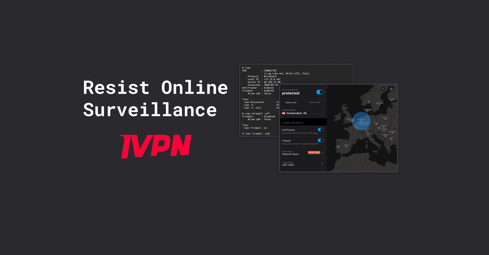

IVPN is a fairly popular and generally trustworthy VPN provider. In this post, I will walk you through how to use the official IVPN client in a ProxyVM on Qubes OS. We will deviate from the [official guide](https://www.ivpn.net/knowledgebase/linux/ivpn-on-qubes-os/) by using systemd path to handle DNAT. This will provide the same robustness as their approach to modify `/opt/ivpn/etc/firewall.sh`, while avoiding the risk that the modifications will be overwritten by a future app update. We will also be using a TemplateVM for IVPN ProxyVMs instead of using Standalone VMs.

## Preparing your TemplateVM

I recommend that you make a new TemplateVM based on the latest Fedora GNOME template and remove all unnecessary packages that you might not use. This way, you can minimize the attack surface while not having to deal with missing dependencies like on a minimal template. With that being said, if you do manage to get the minimal template to fully work with IVPN, feel free to [open a discussion on GitHub](https://github.com/orgs/PrivSec-dev/discussions) or [contact me directly](https://tommytran.io/contact) and I will update the post accordingly.

I run [this script](https://github.com/TommyTran732/QubesOS-Scripts/blob/main/fedora-gnome/fedora-gnome.sh) on my template to trim it down.

Next, you need to create the bind directories for IVPN's configurations:

```bash
sudo mkdir -p /etc/qubes-bind-dirs.d
echo 'binds+=( '\'''/etc/opt/ivpn/mutable''\'' )' | sudo tee /etc/qubes-bind-dirs.d/50_user.conf 
```

## Installing the IVPN App

Inside of the TemplateVM you have just created, do the following:

```bash
sudo dnf config-manager addrepo --from-repofile=https://repo.ivpn.net/stable/fedora/generic/ivpn.repo
sudo dnf install -y ivpn-ui
```

IVPN needs to restart `systemd-resolved` and run `/usr/lib/qubes/qubes-setup-dnat-to-ns` every time IVPN modifies `/etc/resolv.conf`. Create the following files:

- `/etc/systemd/system/dnat-to-ns.service`
```
[Unit]
Description=Run /usr/lib/qubes/qubes-setup-dnat-to-ns
StartLimitIntervalSec=0

[Service]
Type=oneshot
ExecStart=/usr/bin/systemctl restart systemd-resolved
ExecStart=/usr/lib/qubes/qubes-setup-dnat-to-ns
```

- `/etc/systemd/system/dnat-to-ns.path`

```
[Unit]
Description=Run /usr/lib/qubes/qubes-setup-dnat-to-ns when /etc/resolv.conf changes

[Path]
PathChanged=/etc/resolv.conf
Unit=dnat-to-ns.service

[Install]
WantedBy=multi-user.target
```

- `/etc/systemd/system/dnat-to-ns-boot.service`

```
[Unit]
Description=Run /usr/lib/qubes/qubes-setup-dnat-to-ns
After=qubes-network-uplink.service

[Service]
Type=oneshot
ExecStart=sleep 15
ExecStart=/usr/lib/qubes/qubes-setup-dnat-to-ns

[Install]
WantedBy=multi-user.target
```

Create `/etc/systemd/system/systemd-resolved.conf.d/override.conf` to disable rate limiting on systemd-resolved restarting:

```
[Unit]
StartLimitIntervalSec=0
```

Next, enable the systemd path and service to run at boot:

```bash
sudo systemctl enable dnat-to-ns.path
sudo systemctl enable dnat-to-ns-boot.service
```

Finally, shut down the TemplateVM:

```bash
sudo shutdown now
```

## Creating the ProxyVM

Create an AppVM based on the TemplateVM you have just created. Set `sys-firewall` (or whatever FirewallVM you have connected to your `sys-net`) as the net qube. If you do not have such FirewallVM, use `sys-net` as the net qube. Next, go to the advanced tab and tick the `provides network access to other qubes` box.


Open the IVPN and select `Settings` → `DNS` → `Force management of DNS using resolv.conf`.

Go to the `IVPN Firewall` section and tick the box `Allow LAN traffic when IVPN Firewall is enabled`. Due to some strange interaction between qubes services and IVPN, certain apps will get internet connections while others do not if this toggle is not enabled. This option will **not** actually allow AppVMs connected to the ProxyVM to connect to the local network.

Enable `Always-on firewall` to ensure that the killswitch stays on even when the tunnel is disconnected.

## Additional Assurances

For additional assurances against VPN leaks, you can optionally add these 2 lines to `/rw/config/qubes-firewall-user-script`:

```bash
nft add rule qubes custom-forward oifname eth0 counter drop
nft add rule ip6 qubes custom-forward oifname eth0 counter drop
```

This is not strictly necessary, as I have not observed any leaks with the VPN killswitch provided by the app.

## Notes

With this current setup, the ProxyVM you have just created will be responsible for handling Firewall rules for the qubes behind it. This is not ideal, as this is still a fairly large VM, and there is a risk that IVPN or some other apps may interfere with its firewall handling.

Instead, I highly recommend that you [create a minimal Mirage FirewallVM](/posts/qubes/firewalling-with-mirageos-on-qubes-os/) and use it as a firewall **behind** the IVPN ProxyVM. Other AppVMs then should use the Mirage Firewall as the net qube instead. This way, you can make sure that firewall rules are properly enforced.
