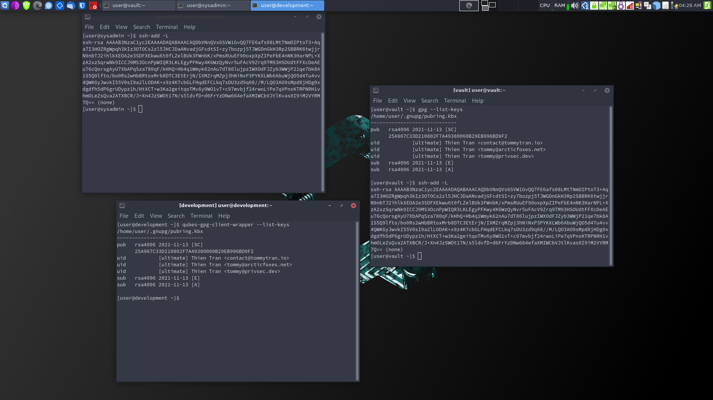
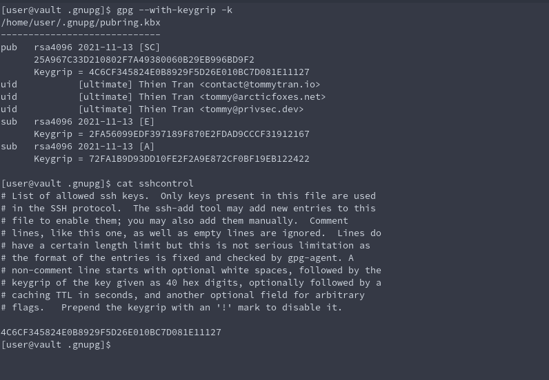

This post will go over setting up Split GPG, then setting up Split SSH with the same PGP keys. Effectively, we are emulating what you can do with a PGP smartcard on Qubes OS.

## Split GPG

Follow the official Qubes OS [documentation](https://www.qubes-os.org/doc/split-gpg/) to set this up.

Note that if you already have a PGP key with a passphrase, you can remove it by installing `pinentry-gtk` to `vault`'s TemplateVM, then run `gpg2 --edit-key <key_id>` and `passwd` to set an empty passphrase. The default non-graphical pinentry will just make an infinite loop and will not allow you to set an empty passphrase.

## Split SSH

This part is based on the Qubes Community's [guide](https://forum.qubes-os.org/t/split-ssh/19060); however, I will deviate from it to use the PGP keys for SSH instead of generating a new key pair.

### In `dom0`

- Create `/etc/qubes-rpc/policy/qubes.SshAgent` with `@anyvm @anyvm ask,default_target=vault` as the content. Since the keys are not passphrase protected, you should **not** set the policy to allow.

### In `vault` AppVM
- Add `enable-ssh-support` to the end of `~/.gnupg/gpg-agent.conf`
- Get your keygrip with `gpg --with-keygrip -k`
- Add your keygrip to the end of `~/.gnupg/sshcontrol`



### In `vault`'s TemplateVM

- Create `/etc/qubes-rpc/qubes.SshAgent` with the following content:    
```bash
#!/bin/sh
# Qubes App Split SSH Script

# Activate GPG Agent and set the correct SSH socket
export SSH_AUTH_SOCK=$(gpgconf --list-dirs agent-ssh-socket)
gpgconf --launch gpg-agent

# safeguard - Qubes notification bubble for each ssh request
notify-send "[$(qubesdb-read /name)] SSH agent access from: $QREXEC_REMOTE_DOMAIN"

# SSH connection
socat - "UNIX-CONNECT:$SSH_AUTH_SOCK"

```

- Make it executable with `sudo chmod +x /etc/qubes-rpc/qubes.SshAgent`
- Turn off the templateVM. If the `vault` VM is running, turn it off, then start it to update the VM's configuration.

### In `ssh-client` AppVM

- Add the following to the end of `/rw/config/rc.local`:
```bash
# SPLIT SSH CONFIGURATION >>>
# replace "vault" with your AppVM name which stores the ssh private key(s)
SSH_VAULT_VM="vault"

if [ "$SSH_VAULT_VM" != "" ]; then
  export SSH_SOCK="/home/user/.SSH_AGENT_$SSH_VAULT_VM"
  rm -f "$SSH_SOCK"
  sudo -u user /bin/sh -c "umask 177 && exec socat 'UNIX-LISTEN:$SSH_SOCK,fork' 'EXEC:qrexec-client-vm $SSH_VAULT_VM qubes.SshAgent'" &
fi
# <<< SPLIT SSH CONFIGURATION
```

- Add the following to the end of `~/bash.rc`:
```bash
# SPLIT SSH CONFIGURATION >>>
# replace "vault" with your AppVM name which stores the ssh private key(s)
SSH_VAULT_VM="vault"

if [ "$SSH_VAULT_VM" != "" ]; then
  export SSH_AUTH_SOCK="/home/user/.SSH_AGENT_$SSH_VAULT_VM"
fi
# <<< SPLIT SSH CONFIGURATION
```

- Restart `ssh-client` and confirm if it's working with `ssh-add -L`.

### Limitations
A malicious `ssh-client` AppVM can hold onto the ssh-agent connection for more than one use until it is shut down. While your private key is protected, a malicious actor with access to the AppVM can still abuse the ssh-agent to log into your servers.
